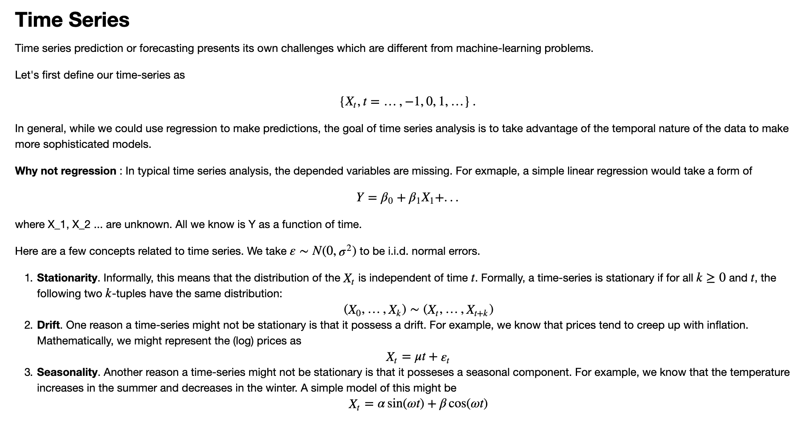
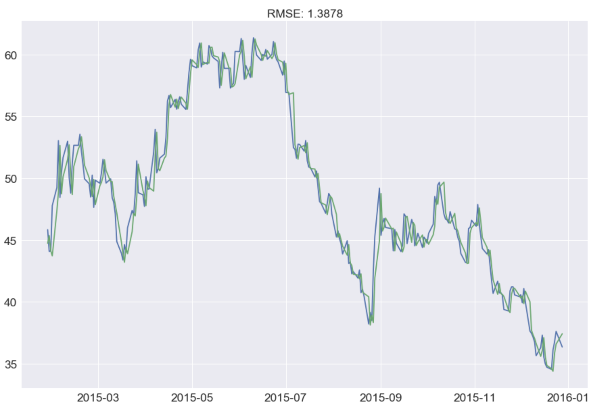

# Oil-Price-Prediction-ARIMA

### Introduction
Oil price forecasting using ARIMA.
Data: Quadl Crude oil dataset
Challenge: Time Series data
Concepts: ARIMA(p,d,q), Time series
Algorithms: Support Vector Regression RBF, Linear Regression, Auto Correlation Function(ACF)

### Setup
Install Quandl `conda install -c anaconda quandl ` [here](https://anaconda.org/anaconda/quandl)
pandas==0.17.0
numpy
seaborn

### Discussion

# Time Series

### SVR RBF

## Advanced Time Series Models
### Check for Stationarity in a series?

***Plotting Rolling Statistics:*** Plot the moving average or moving variance and see if it varies with time. By moving average/variance I mean that at any instant ‘t’, we’ll take the average/variance of the last year, i.e. last 12 months. But again this is more of a visual technique.

**Dickey-Fuller Test:** This is one of the statistical tests for checking stationarity. Here the null hypothesis is that the time series is non-stationary. The test results comprise of a Test Statistic and some Critical Values for difference confidence levels. If the ‘Test Statistic’ is less than the ‘Critical Value’, we can reject the null hypothesis and say that the series is stationary.

Statistical tests make strong assumptions about your data. They can only be used to inform the degree to which a null hypothesis can be accepted or rejected. The result must be interpreted for a given problem to be meaningful.

***Null Hypothesis (H0):*** If accepted, it suggests the time series has a unit root, meaning it is non-stationary. It has some time dependent structure.

***Alternate Hypothesis (H1):*** The null hypothesis is rejected; it suggests the time series does not have a unit root, meaning it is stationary. It does not have time-dependent structure.
We interpret this result using the p-value from the test. 

A p-value below a threshold (such as 5% or 1%) suggests we reject the null hypothesis (stationary), otherwise a p-value above the threshold suggests we accept the null hypothesis (non-stationary).

***p-value > 0.05: *** Accept the null hypothesis (H0), the data has a unit root and is non-stationary.

***p-value <= 0.05: *** Reject the null hypothesis (H0), the data does not have a unit root and is stationary.

### Non-Stationarity 
Decomposing the Time Series into `Seasonality`, `Trend` and `Residuals`

### Stationarity Check

Checking for the Stationarity for all the decomposed values.

### Auto Correlation
The Pearson’s correlation coefficient is a number between -1 and 1 that describes a negative or positive correlation respectively. A value of zero indicates no correlation.

### Partial Auto correlation
A partial auto correlation is a summary of the relationship between an observation in a time series with observations at prior time steps with the relationships of intervening observations removed.

PACF with 5 lags

PACF with 10 lags

In this plot, the two dotted lines on either sides of 0 are the confidence interevals. These can be used to determine the ‘p’ and ‘q’ values as:

**p** – The lag value where the **PACF** chart crosses the upper confidence interval for the first time. If you notice closely, in this case **p=2**.

**q** – The lag value where the **ACF** chart crosses the upper confidence interval for the first time. If you notice closely, in this case **q=3**.

## ARIMA(p,d,q) Model
ARIMA order (p,d,q) = 2, 2, 10
Predicting the next 6000 timestamps, the RSME is 1.49

Comparing the predicted values with the actual values

### Testing

